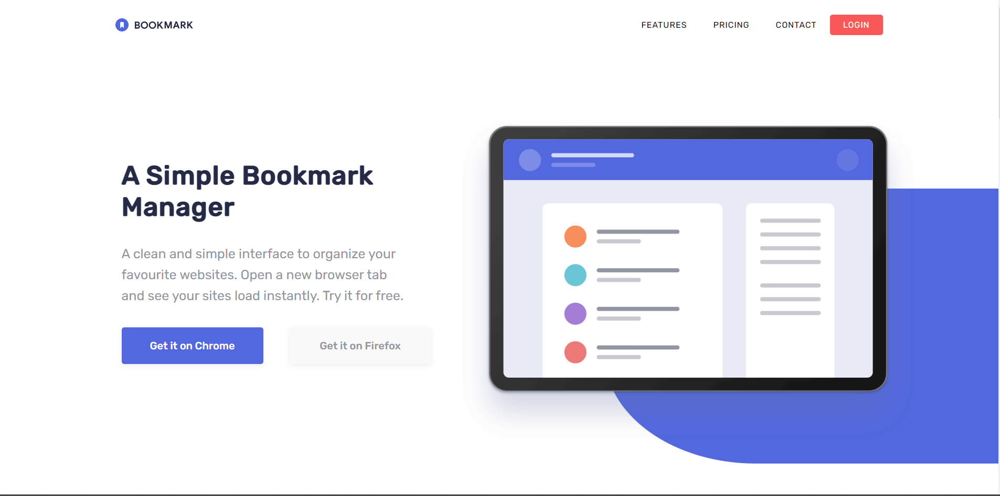
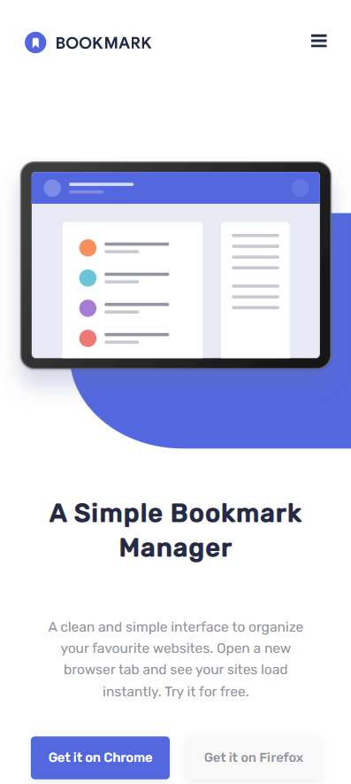

# Frontend Mentor - Bookmark landing page solution

This is a solution to the [Bookmark landing page challenge on Frontend Mentor](https://www.frontendmentor.io/challenges/bookmark-landing-page-5d0b588a9edda32581d29158). Frontend Mentor challenges help you improve your coding skills by building realistic projects. 

## Table of contents

- [Overview](#overview)
  - [The challenge](#the-challenge)
  - [Screenshot Desktop](#screenshot-destop)
  - [Screenshot Mobile](#screenshot-mobile)
  - [Links](#links)
- [My process](#my-process)
  - [Built with](#built-with)
  - [What I learned](#what-i-learned)
- [Author](#author)

## Overview
Bookmark Manager Landing Page, Built Using React

### The challenge

Users should be able to:

- View the optimal layout for the site depending on their device's screen size
- See hover states for all interactive elements on the page
- Receive an error message when the newsletter form is submitted if:
  - The input field is empty
  - The email address is not formatted correctly

### Screenshot Desktop



### Screenshot Mobile



### Links

- Solution URL: [Add solution URL here](https://github.com/ovie009/bookmark-manager)
- Live Site URL: [Add live site URL here](https://ovie-bookmark-manager.netlify.app/)

## My process

### Built with

- CSS custom properties
- Flexbox
- Mobile-first workflow
- [React](https://reactjs.org/) - JS library

### What I learned

React Conditional Rendering, and creating an accordion

```js
const proudOfThisFunc = () => {
  console.log('🎉')
}
```
## Author

- Website - [Iffie Ovie](https://iffieovie.netlify.com)
- Frontend Mentor - [@ovie009](https://www.frontendmentor.io/profile/ovie009)
- Twitter - [@iffieOvie](https://www.twitter.com/iffieoive)
